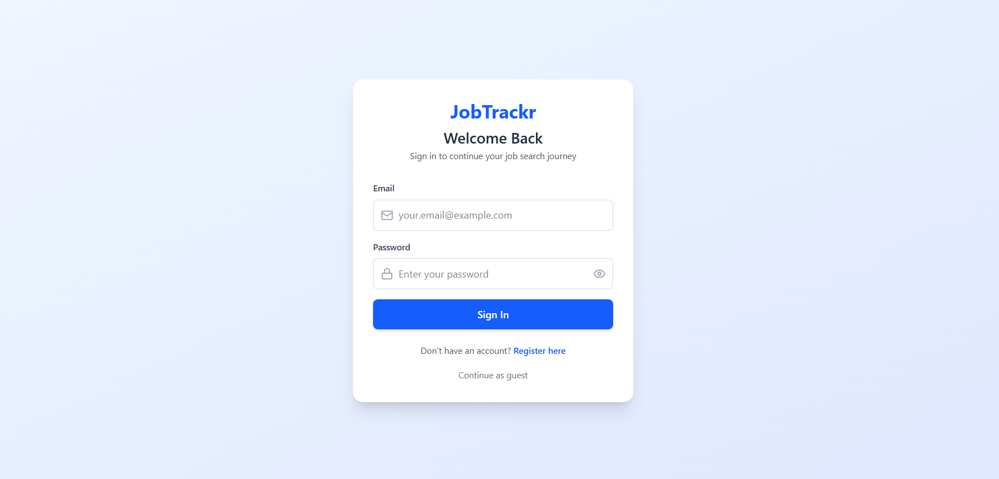
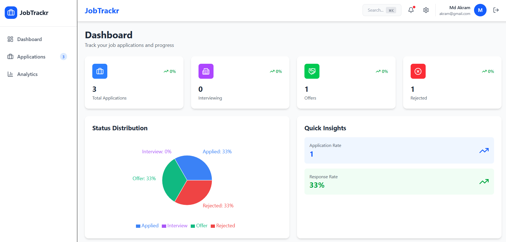
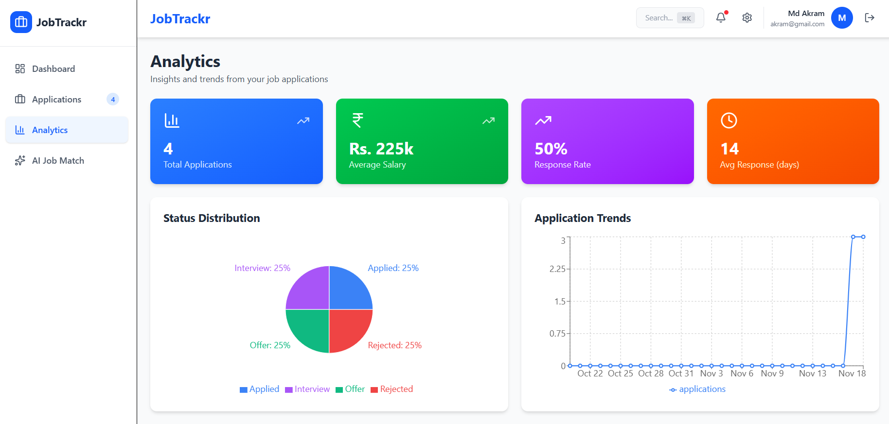
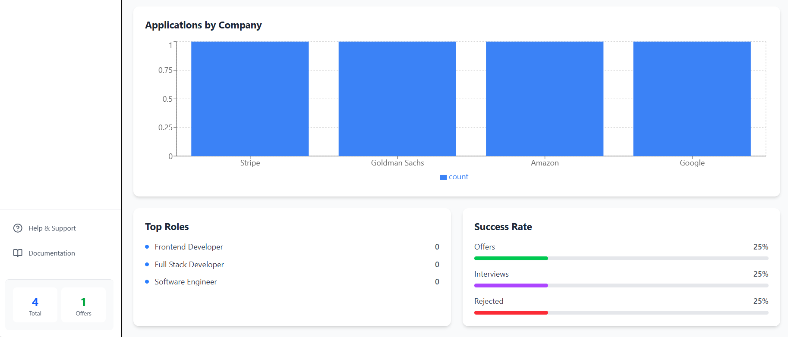
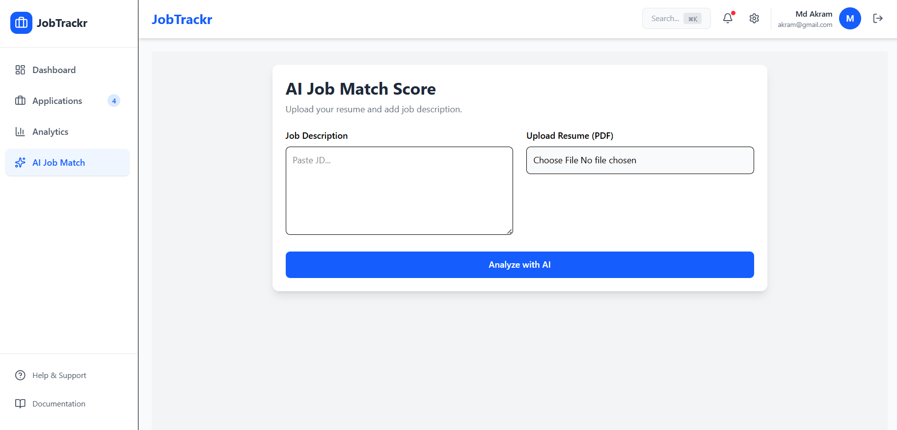
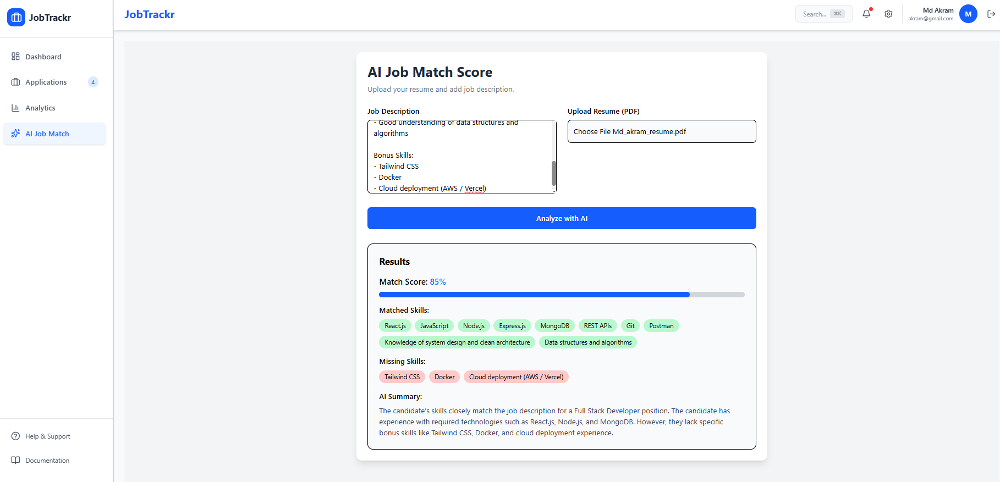

# 🎯 JobTrackr - AI-Powered Job Application Tracker

> **A beautiful, production-ready job application tracking system built with React 19, Tailwind CSS, Express, MongoDB — now enhanced with Local AI Resume Matching using Ollama + Mistral.**

[](https://react.dev/)
[](https://tailwindcss.com/)
[](https://vitejs.dev/)
[](https://nodejs.org/)
[](LICENSE)

## ✨ Overview

JobTrackr is a complete Job Application Tracking System designed to help job seekers **track**, **analyze**, and **manage** their job applications.  
Now upgraded with **AI-driven Resume–JD Matching**, powered by **Ollama (local LLM)** — giving users offline AI features *with full privacy and zero cost*.

---

## 📸 Screenshots

### Login Page


### Dashboard 


### Application Page


### Analytics Page


### Analytics Page


### AI Job Match Page


### AI Job Match Page


---

## 🤖 NEW — Local AI Resume Matching (Ollama)

### What this AI feature does:
- Upload a **PDF Resume**
- AI extracts text from the resume
- User pastes the **Job Description**
- Ollama’s **Mistral model** compares both
- Returns:
  - ✔ Matched Skills  
  - ✔ Missing Skills  
  - ✔ Match Score (0–100%)  
  - ✔ AI Summary (2–3 lines)

### Why this is awesome:
- **100% private** — nothing leaves your device  
- **Free** — no tokens or API charges  
- **Fast** — runs on your CPU/GPU  
- **Reliable** — no rate limits or outages  

---

## 🚀 Quick Start

### Prerequisites
- Node.js (v18+)
- MongoDB (local or Atlas)
- **Ollama installed** — https://ollama.com
- Pull required LLM model:

```bash
ollama pull mistral
npm run dev
```

## 🌟 Key Features

### 📊 Dashboard
- Real-time statistics and metrics
- Visual data representations
- Recent applications overview
- Quick insights

### 💼 Applications Management
- Full CRUD operations
- Advanced search and filtering
- Multiple sorting options
- Grid and list view modes
- Rich application details

### 📈 Analytics
- Comprehensive charts and graphs
- Success rate tracking
- Company-wise analysis
- Trend analysis over time

### 🔐 Authentication
- Beautiful login/register pages
- Mock authentication system
- Guest mode support
- User profile management

### 📱 Responsive Design
- Mobile-first approach
- Tablet optimization
- Desktop experience
- Touch-friendly interface

## 🛠️ Tech Stack

### Frontend
- **Framework**: React 19
- **Build Tool**: Vite 7
- **Styling**: Tailwind CSS 4
- **Routing**: React Router 7
- **Charts**: Recharts
- **Icons**: Lucide React
- **State Management**: Context API

### Backend
- **Runtime**: Node.js
- **Framework**: Express.js
- **Database**: MongoDB with Mongoose
- **Authentication**: JWT (JSON Web Tokens)
- **Password Hashing**: Bcrypt
- **Validation**: Mongoose Validators

## 📁 Project Structure

```
ai-job-application-tracker/
├── frontend/                # React application
│   ├── src/
│   │   ├── components/      # UI components
│   │   ├── contexts/        # State management
│   │   ├── pages/           # Page components
│   │   ├── services/        # API services
│   │   └── utils/           # Utilities
│   ├── public/
│   └── package.json
│
├── backend/                 # Express API server
│   ├── models/              # MongoDB schemas
│   ├── routes/              # API routes
│   ├── middleware/          # Auth middleware
│   ├── scripts/             # Utilities
│   ├── server.js            # Main server
│   └── package.json
│
└── Documentation/
    ├── SETUP_GUIDE.md
    ├── BACKEND_SETUP.md
    └── README.md
```

## 🎨 Design Highlights

- **Modern UI**: Clean, intuitive interface
- **Color Scheme**: Professional blue palette
- **Icons**: 20+ Lucide React icons
- **Animations**: Smooth transitions
- **Responsive**: Mobile, tablet, desktop
- **Accessible**: WCAG compliant
- **Real-time**: Live data updates

## 📦 Available Scripts

### Frontend
```bash
cd frontend
npm run dev      # Development server
npm run build    # Production build
npm run preview  # Preview build
```

### Backend
```bash
cd backend
npm run dev      # Development with auto-reload
npm start        # Production mode
npm run seed     # Seed sample data
```

## 🔧 Configuration

### Frontend Environment

Create `frontend/.env`:
```env
VITE_API_URL=http://localhost:5000/api
```

### Backend Environment

Create `backend/.env`:
```env
PORT=5000
NODE_ENV=development
MONGO_URI=mongodb://localhost:27017/jobtrackr
JWT_SECRET=your_secret_key
JWT_EXPIRE=7d
FRONTEND_URL=http://localhost:5173
```

## 🤝 Contributing

Contributions are welcome! Please feel free to submit a Pull Request.

1. Fork the repository
2. Create your feature branch (`git checkout -b feature/AmazingFeature`)
3. Commit your changes (`git commit -m 'Add some AmazingFeature'`)
4. Push to the branch (`git push origin feature/AmazingFeature`)
5. Open a Pull Request

## 📄 License

This project is licensed under the MIT License - see the LICENSE file for details.

## 🙏 Acknowledgments

- React team for the amazing framework
- Tailwind CSS for the utility-first CSS
- Vite for the blazing fast build tool
- All the open-source contributors


**Built  for efficient job application tracking**


